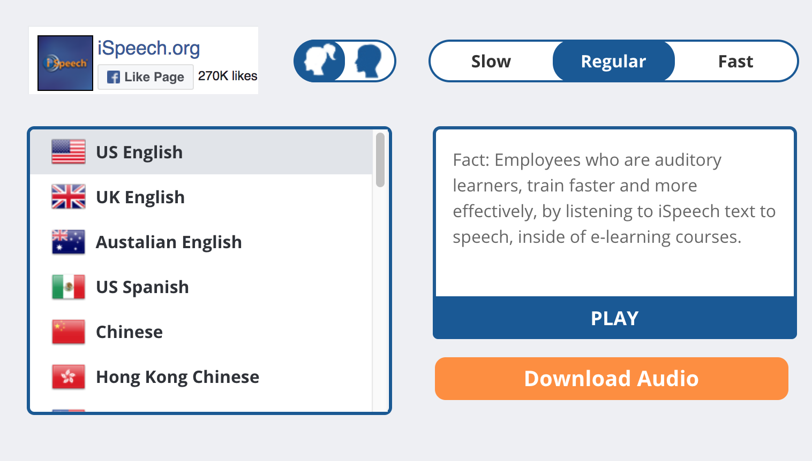
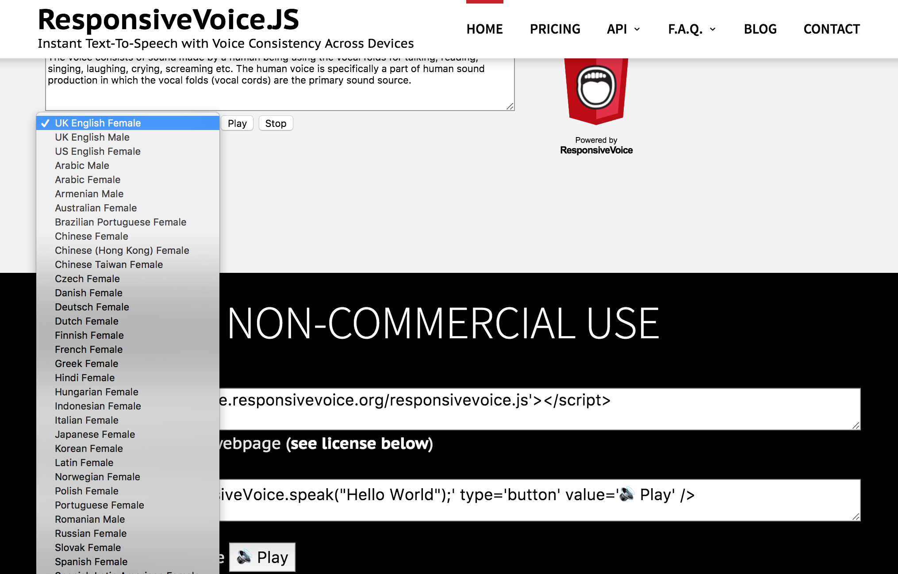
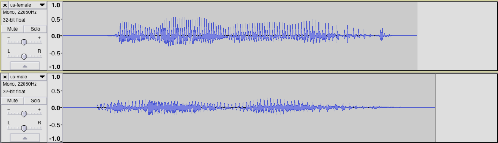
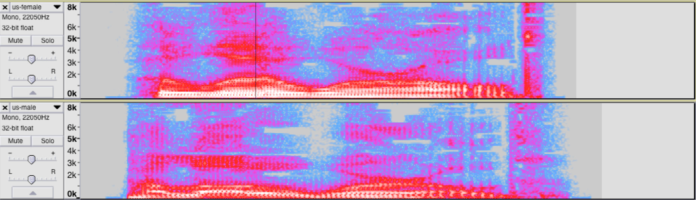

# Genderless AI - WIP

> Genderless AI: I am really confused about the fact that people usually assume AI or Virtual Assitant as female figure. I want to dig in deeper about this issue. Here is the documentation about my research / proposal project about genderless voice, genderless language in AI.

#### Genderless Voice
I found out that most of Text-To-Speech services offer voices for both female and male, and some only offer female's. Below are some examples.
- [ISpeech](https://www.ispeech.org/) 

- [ResponsiveVoice.JS](https://responsivevoice.org/) 

I wander: Is it possible to just make a voice that is gender LESS? I started with analysing the difference between female and male voice. I used [this website](http://www.fromtexttospeech.com/) to generate two audio files, "Hello World" from American Female 'Alice' and American Male 'John'. I dragged them to Audacity and screenshot the waveform and spectrogram of these two voices.

#### Genderless language
